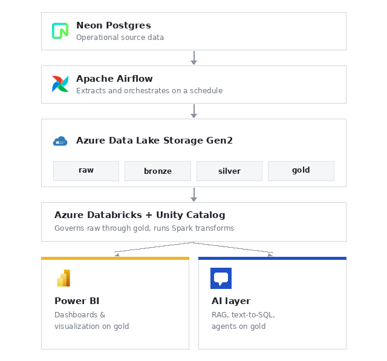

# NexusData

An end-to-end Data + AI platform from a live operational database to a governed Azure lakehouse to an AI layer for natural-language insights.

## How it works

1. **Neon Postgres** operational source data (customers, orders, payments, shipments, etc.)
2. **Apache Airflow** extracts tables on a schedule and lands them in the `raw` zone
3. **Azure Data Lake Storage Gen2** stores data across `raw → bronze → silver → gold` zones
4. **Azure Databricks + Unity Catalog** governs the lakehouse and runs Spark transformations
5. **Power BI** dashboards and visualization on top of gold
6. **AI layer** RAG, text-to-SQL, and agents for natural-language querying of gold data

## Status

- [x] Source data generated and loaded into Neon
- [x] Airflow extraction into raw
- [x] Bronze ingestion (Delta tables, Unity Catalog)
- [x] Silver cleaning and standardization
- [x] Gold business-ready aggregates
- [x] Automated Airflow → Databricks job triggering
- [x] AI layer (RAG, text-to-SQL, agents)
- [ ] Power BI

## Tech stack

Python · PostgreSQL · Apache Airflow · Azure Data Lake Storage Gen2 · Azure Databricks · Delta Lake · Unity Catalog · Power BI
