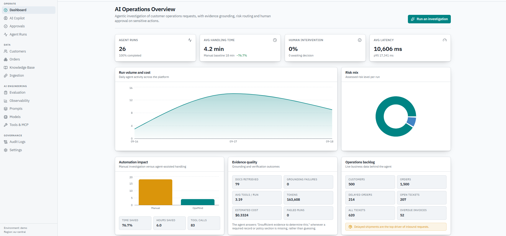
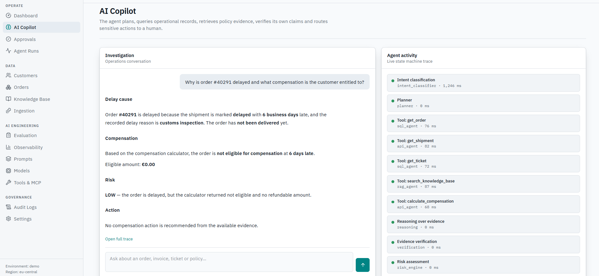
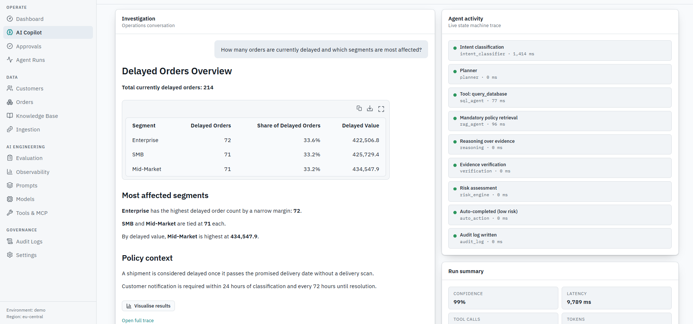
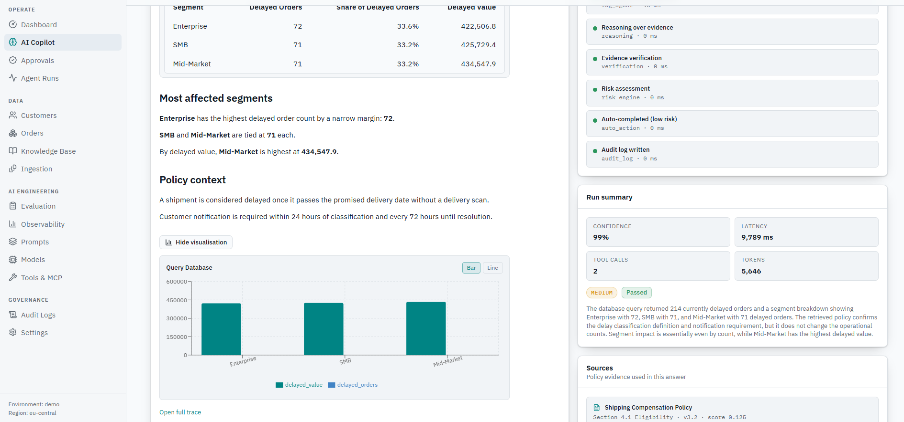
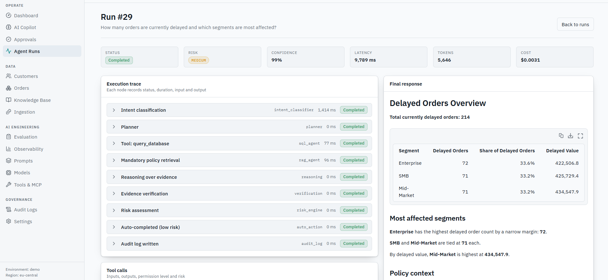
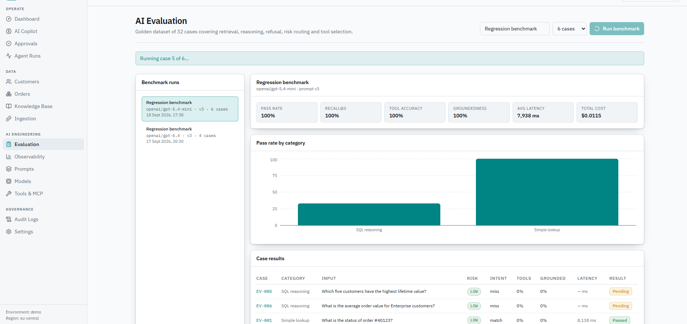
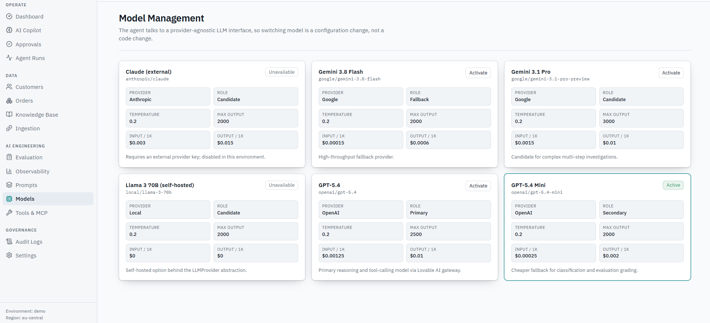
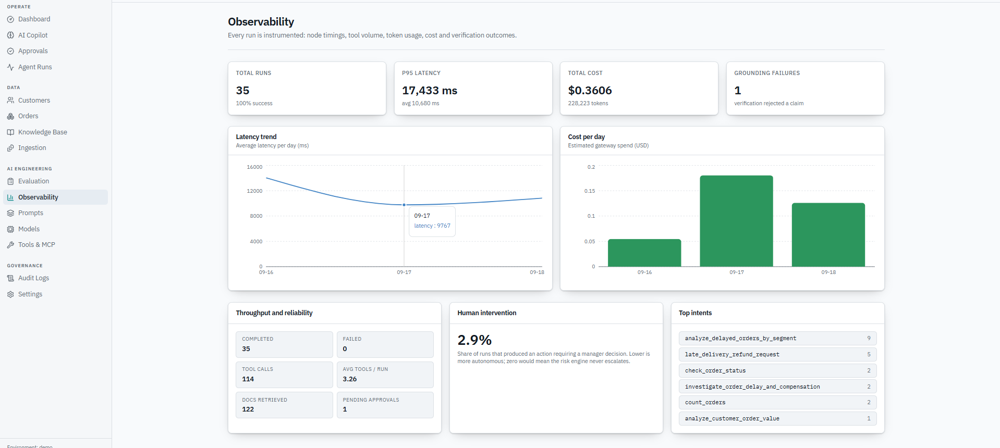

# NexusData — Data Intelligence Platform

NexusData is a full-stack agentic data intelligence platform. The agent plans, queries operational records, retrieves policy evidence, verifies its own claims, scores risk, and routes sensitive actions to a human before anything is executed.

All customer, order, ticket and invoice data in this environment is **synthetic**.

---

## UI Walkthrough

### 1. Dashboard — AI Operations Overview



The main landing page gives a live operational pulse of the entire platform at a glance.

**Top KPI cards:**
- **Agent Runs** — total number of completed investigations (26, 100% completed).
- **Avg Handling Time** — average time to resolve a request (4.2 min), shown against the manual baseline of 18 min — a **76.7% reduction**.
- **Human Intervention** — share of runs that required a manager decision (0% awaiting).
- **Avg Latency** — end-to-end agent latency (10,606 ms avg, p95 17,341 ms).

**Charts and panels:**
- **Run volume and cost** — area chart of daily agent activity over a rolling 3-day window.
- **Risk mix** — donut chart showing the proportion of LOW / MEDIUM / HIGH / CRITICAL risk runs.
- **Automation impact** — bar chart comparing manual investigation time vs. agent-assisted time, with summary stats: 76.7% time saved, 6.0 hours saved, 83 total tool calls.
- **Evidence quality** — scorecard: 79 docs retrieved, 0 grounding failures, 3.19 avg tools/run, 163,608 tokens consumed, \$0.3324 estimated cost, 0 failed runs.
- **Operations backlog** — live business metrics: 500 customers, 1,500 orders, 214 delayed orders, 207 open tickets, 620 total tickets, 52 overdue invoices. An alert banner highlights the top driver: *"Delayed shipments are the top driver of inbound requests."*

---

### 2. AI Copilot — Investigation Chat

**Step 1 — Ask a question and get a grounded answer**



The AI Copilot is the primary interface for natural-language operational investigations. A user types a question and the agent works through a full state-machine pipeline to produce a structured, evidence-backed answer.

In this example the question is:
> *"Why is order #40291 delayed and what compensation is the customer entitled to?"*

The agent responds with clearly labelled sections:
- **Delay cause** — the order is 6 business days late due to customs inspection and has not been delivered.
- **Compensation** — based on the compensation calculator, the order is not eligible; eligible amount is €0.00.
- **Risk** — classified as LOW (delayed, but no refundable amount).
- **Action** — no compensation action recommended from the available evidence.

The **Agent activity** panel on the right shows the live state-machine trace as it executes:
`Intent classification ? Planner ? Tool: get_order ? Tool: get_shipment ? Tool: get_ticket ? Tool: search_knowledge_base ? Tool: calculate_compensation ? Reasoning over evidence ? Evidence verification ? Risk assessment`

Each step shows its executor (e.g. `sql_agent`, `rag_agent`, `api_agent`) and duration in milliseconds.

---

**Step 2 — Aggregate query with a data table response**



For aggregate questions, the agent runs SQL against the operational database and returns structured tabular results alongside a plain-language summary.

Question: *"How many orders are currently delayed and which segments are most affected?"*

The agent returns a **Delayed Orders Overview** with:
- Total currently delayed orders: **214**
- A breakdown table by segment: Enterprise (72 orders, 33.6%, €422,506.8 delayed value), SMB (71, 33.2%, €425,729.4), Mid-Market (71, 33.2%, €434,547.9).
- **Most affected segments** — written narrative: Enterprise leads by count; Mid-Market leads by delayed value.
- **Policy context** — the agent automatically retrieves the relevant shipping policy: *"A shipment is considered delayed once it passes the promised delivery date without a delivery scan. Customer notification is required within 24h of classification."*

The agent activity trace confirms: `query_database (sql_agent) ? Mandatory policy retrieval (rag_agent) ? Reasoning ? Evidence verification ? Risk assessment ? Auto-completed (low risk) ? Audit log written`.

The run summary shows **99% confidence**, **9,789 ms latency**, **2 tool calls**, **5,646 tokens**.

---

**Step 3 — Inline data visualisation**



The same response expanded to show the inline chart. After delivering the table and narrative, the agent offers a **"Visualise results"** button. When clicked, a bar chart is rendered directly in the conversation panel, plotting delayed value and delayed order counts per segment (Enterprise, SMB, Mid-Market).

The right panel shows the complete **Run summary** and **Sources** — the exact policy document chunks that grounded the answer (e.g. *Shipping Compensation Policy, Section 4.1 Eligibility, v3.2, score 0.125*), making every claim fully auditable.

---

**Step 4 — Full run trace (Agent Runs detail page)**



Every investigation is permanently recorded as a numbered run. Clicking into a run (e.g. **Run #29**) opens the full execution trace.

**Header metrics:** Status (Completed), Risk (MEDIUM), Confidence (99%), Latency (9,789 ms), Tokens (5,646), Cost (\$0.0031).

**Execution trace panel** each state-machine node is a collapsible row showing:
- Node name and executor type
- Duration
- Pass/Completed badge

Nodes in this run: Intent classification (1,414 ms) ? Planner ? Tool: query_database (77 ms) ? Mandatory policy retrieval (96 ms) ? Reasoning over evidence ? Evidence verification ? Risk assessment ? Auto-completed (low risk) ? Audit log written.

**Final response panel** on the right mirrors the exact structured answer the user received, with the segment table inline — confirming the trace and the answer are in sync.

**Tool calls** section below (not pictured in full) lists every individual tool invocation with its input payload, output, permission level and risk classification.

---

### 3. AI Evaluation — Regression Benchmarking



The Evaluation page runs the agent against a **golden dataset of 32 cases** covering retrieval, reasoning, refusal behaviour, risk routing and tool selection. It is designed for CI-gate usage: a benchmark can block a deploy if quality regresses.

**Benchmark runs sidebar** — lists past runs with model slug, prompt version and case count.

**Active benchmark summary panel** — the currently selected run (Regression benchmark, `openai/gpt-5.4-mini`, prompt v3, 6 cases) shows aggregated scores:
- **Pass rate:** 100%
- **Recall@5:** 100%
- **Tool accuracy:** 100%
- **Groundedness:** 100%
- **Avg latency:** 7,938 ms
- **Total cost:** \$0.0115

**Pass rate by category** — bar chart breaking down pass rate by test category (SQL reasoning vs. Simple lookup).

**Case results table** — each golden case row shows: Case ID, category, input question, risk level, intent match, tool accuracy, groundedness score, latency and result badge (Passed / Pending / Failed).

A live progress banner (*"Running case 5 of 6..."*) updates in real time as the benchmark executes in batches.

---

### 4. Model Management



The Model Management page lists every LLM in the registry as a card. Switching the active model is a **configuration change, not a code change** — the gateway layer is provider-agnostic.

Each card shows:
- **Model name and slug** (e.g. `openai/gpt-5.4-mini`)
- **Provider** (OpenAI, Google, Anthropic, Local)
- **Role** — Primary, Secondary, Fallback, or Candidate
- **Temperature** and **Max output tokens**
- **Pricing** — input cost per 1K tokens and output cost per 1K tokens
- **Status** — Active (highlighted border), Activate button, or Unavailable

Models visible in the demo:
| Model | Provider | Role | Status |
|---|---|---|---|
| Claude (external) | Anthropic | Candidate | Unavailable |
| Gemini 3.8 Flash | Google | Fallback | Activatable |
| Gemini 3.1 Pro | Google | Candidate | Activatable |
| Llama 3 70B (self-hosted) | Local | Candidate | Unavailable |
| GPT-5.4 | OpenAI | Primary | Activatable |
| GPT-5.4 Mini | OpenAI | Secondary | **Active** |

---

### 5. Observability



The Observability page instruments every run end-to-end: node timings, tool volume, token usage, cost and verification outcomes.

**Top KPI cards:**
- **Total runs:** 35 (100% success)
- **P95 latency:** 17,433 ms (avg 10,680 ms)
- **Total cost:** \$0.3606 across 228,223 tokens
- **Grounding failures:** 1 (verification rejected a claim)

**Charts:**
- **Latency trend** — line chart of average latency per day over the rolling 3-day window (peaks at ~13,000 ms on 09-16, dips to 9,767 ms on 09-17, then stabilises).
- **Cost per day** — bar chart of estimated gateway spend (USD) per day.

**Throughput and reliability panel:**
- Completed: 35 | Failed: 0
- Tool calls: 114 | Avg tools/run: 3.26
- Docs retrieved: 122 | Pending approvals: 1

**Human intervention:** 2.9% of runs produced an action requiring a manager decision. Lower is more autonomous; zero means the risk engine never escalates.

**Top intents:** ranked list of the most common investigation types:
1. `analyze_delayed_orders_by_segment` — 9 runs
2. `late_delivery_refund_request` — 5 runs
3. `check_order_status` — 2 runs
4. `investigate_order_delay_and_compensation` — 2 runs
5. `count_orders` — 2 runs
6. `analyze_customer_order_value` — 1 run

---

## Architecture

```text
Browser (TanStack Start / React 19)
  +-- server functions (typed RPC, server-only)
        +-- agent.server.ts     state machine orchestrator
        +-- tools.server.ts     tool registry (schema + permission + risk)
        +-- gateway.server.ts   provider-agnostic LLM interface
        +-- evaluation.functions.ts  benchmark engine
              +-- Postgres (business data, knowledge index, run telemetry, audit)
```

### Agent state machine

```text
request ? intent classification ? planning ? tool loop (SQL | RAG | API | logic)
        ? reasoning ? evidence verification ? risk engine
        ? human approval (HIGH/CRITICAL) or auto action ? audit log
```

Every node writes an `agent_steps` row; every tool invocation writes a `tool_calls` row with input, output, status, duration, risk and permission level; every run records latency, tokens and estimated cost. The run trace page replays all of it.

### Grounding rules

- Policy statements may only cite chunks actually returned by `search_knowledge_base`.
- The verification node strips citations that do not match retrieved evidence and fails the run when a policy claim has no supporting chunk; confidence is then capped.
- When a record or policy section is missing, the answer is exactly `Insufficient evidence to determine this.`

### Risk and human-in-the-loop

| Risk | Handling |
| --- | --- |
| LOW / MEDIUM | executed immediately, audited |
| HIGH | approval required (emails, refunds above €250) |
| CRITICAL | approval required (refunds above €1,000) |

`issue_refund` and `create_email_draft` never execute inside the agent loop: calling them only records a proposed action for a manager.

### RBAC

Roles are `viewer < operator < manager < admin`. Each tool declares the minimum role; the registry refuses execution below it and records a `denied` tool call.

---

## MCP Compatibility

Each tool is declared once as a named contract: JSON-schema input, typed result, category, permission level, risk level and approval requirement. That is exactly the shape the Model Context Protocol expects, so exposing the registry over an MCP server is a transport change — `TOOLS` in `src/lib/ops/tools.server.ts` becomes the `tools/list` response and the existing guarded `execute` entry point backs `tools/call`. Validation, permission checks, risk gating and audit logging stay untouched.

---

## Local Development

```bash
bun install
bun run dev     # http://localhost:8080
bunx tsgo --noEmit
```

Server-side environment variables: the AI gateway key and database credentials. Nothing secret is exposed to the browser.

---

## Docker and CI

```dockerfile
FROM oven/bun:1 AS build
WORKDIR /app
COPY package.json bun.lock ./
RUN bun install --frozen-lockfile
COPY . .
RUN bun run build

FROM oven/bun:1-slim
WORKDIR /app
COPY --from=build /app/.output ./.output
ENV PORT=8080
CMD ["bun", "run", ".output/server/index.mjs"]
```

A CI pipeline should run, in order: install ? typecheck (`tsgo --noEmit`) ? lint ? build ? evaluation benchmark against the golden dataset, failing the build when task success or groundedness regresses below the agreed threshold.
